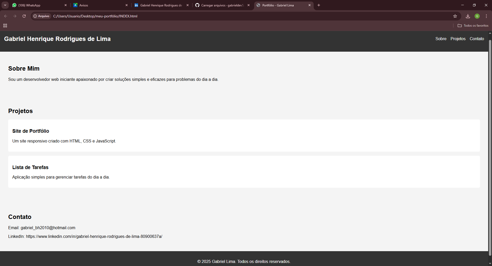

# 📌 #1 Portfólio  - Gabriel Henrique Rodrigues de Lima

## 📖 Sobre o Projeto
Este é um site fictício de portfólio, criado para fins acadêmicos no curso de ADS- Análise e Desenvolvimento de sistemas e praticar dev.front-end.  
Ele demonstra um layout simples e responsivo usando **HTML, CSS e JavaScript**.

---

## 🎯 Funcionalidades
- Página inicial com menu de navegação
- Seção "Sobre Mim"
- Lista de projetos fictícios
- Seção de contato
- Layout responsivo

---

## 🖼 Prévia do Site

---

## 🚀 Tecnologias Utilizadas
- HTML5
- CSS3
- JavaScript

---

## 📚 O que aprendi
- **HTML e Semântica**: estruturação correta das seções da página.  
- **CSS Responsivo**: uso de media queries e boas práticas de estilização.  
- **JavaScript**: manipulação básica do DOM e interatividade simples.  
- **Organização de Projeto**: criação de um layout limpo e organizado para futura evolução.  

---

✉️ **Contato:** gabriel_bh2010@hotmail.com  

## 📂 Estrutura de Pastas

/meu-portfolio
│── index.html
│── README.md
│── script.js
│── style.css
│── preview.png

